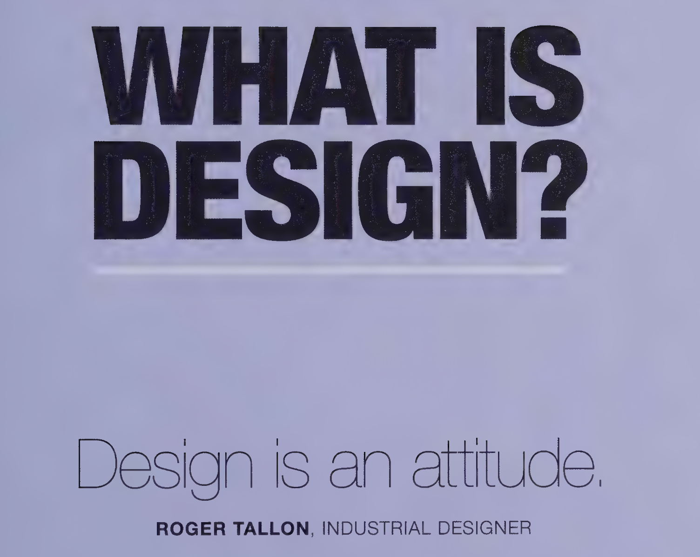

What is Design?




Although the concept of Design has been around for centuries but was coined sometime in 20th century. 
Design is a loose term used in approximately all the disciplines ranging from software engineering to furniture. We see a particular shape and form of the systems we usually interact with on a daily basis. 

Design is usually more than just aethetics. Infact a key differentiator between good design and a piece or art is functionality. Designing systems requires combining pleasing aesthetics along with ease of use design elements.


::: {.class1}

```
Design has to be well defined
```

:::

:::{.callout-important}
Note that there are five types of callouts, including: 
`note`, `tip`, `warning`, `caution`, and `important`.
:::

::: {.border}
This content can be styled with a border
:::

| Line Block
|   Spaces and newlines
|   are preserved


[This text is highlighted]{.mark}

::: {.column-margin}
We know from *the first fundamental theorem of calculus* that for $x$ in $[a, b]$:

$$\frac{d}{dx}\left( \int_{a}^{x} f(u)\,du\right)=f(x).$$
:::

---
reference-location: margin
citation-location: margin
---

[This is a span that has the class `aside` which places it in the margin without a footnote number.]{.aside}

```{mermaid}
flowchart LR
  A[Hard edge] --> B(Round edge)
  B --> C{Decision}
  C --> D[Result one]
  C --> E[Result two]
```

[This text is smallcaps]{.smallcaps}

---


::: {.column-margin}
We know from *the first fundamental theorem of calculus* that for $x$ in $[a, b]$:


:::